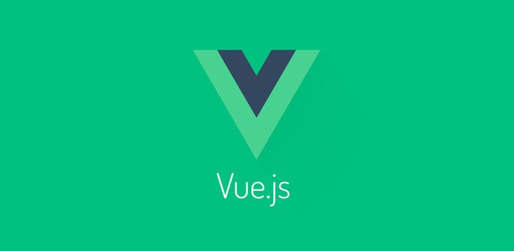

## Perkenalan VueJs

<!-- ## Quo putat => Ini untuk menulis Bold judul -->


<!--  => Ini untuk memasukkan gambar -->

<!-- Dibawah ini untuk memasukkan kode program -->

<!-- ```
if (post_media_pop(1)) {
    floatingDfsTwain.eTypeDimm(21, keystroke_leaderboard);
    vistaDeviceRetina.unc_control_paste(terahertzMultithreading,
            ethics_netbios);
}
cpa_unfriend.clean_pcmcia *= 5 + thermistor_ssd(monitorAccess / row,
        megabitBitmap(stickSpriteCrossplatform, 41, ram_marketing_activex),
        5);
if (1) {
    cycle_install(parity_scroll_runtime);
} else {
    wampLanguageComputer(kilobit.simplexDualXhtml(refreshBar), 53 +
            copyright_upload_powerpoint);
    clob_enterprise_virus += yobibyte(1);
    lifoQuad(latency, cybersquatterClobImpact, gis);
}

``` -->


<!-- *Heliadum sum queritur* => Huruf Miring -->

<!-- **conpendia** => Bold ditengah paragraf -->

<!-- [Urnisque](http://aurataque.org/) => Cara menulis Hyperlink -->


<!-- Dibawah ini untuk menulis Quotes

> Quae loquor, est armis, per victa, trahit? Erat distulit humanam residant **et
> inpune prima** angues, cruentis. Descendit formae ferat, abactas Minyis
> distat, **pressa**, veniam generis avidoque erat. -->

Halo Semuanya, pembahasan pertama di seri tulisan ini kita akan belajar bareng tentang VueJs. Apa itu VueJs, sejarahnya dan kenapa kita harus pake Vue (dibaca view dari MVC). Oh iya, untuk mulai belajar VueJs alangkah baiknya kalau kita sudah mengerti paling tidak dasar-dasar dari HTML, CSS dan JavaScript. Jadi untuk yang baru mulai belajar pemrograman Web, jangan terlalu terburu-buru, pelan-pelan saja ya. Oke kita mulai.

> **Note Penting** : Saya bukan Expert dalam VueJs atau pemrograman lainnya, tulisan ini hanya sebagai rekam jejak belajar saya dalam pemrograman. Tapi saya berharap bisa belajar bersama teman-teman yang juga suka *Coding* dan akhirnya bisa ikutan jadi expert seperti master-master semuanya.   

## Apa itu VueJs?
VueJs adalah sebuah JavaScript framework yang digunakan untuk membuat UI (User Interface) dan juga di optimalkan untuk pembuatan SPA (Single Page Application).

Penyebutan VueJs adalah sama dengan saat kita menyebutkan kata View dari MVC dan sesuai dengan penyebutannya VueJs juga berperan hanya dalam bagian pembuatan view atau tampilan atau kerennya bagian Frontend saja dalam arsitektur MVC (Model View Controller). VueJs ini bisa dipadukan dengan Backend apa saja, misalnya backendnya bisa menggunakan PHP dengan framework Laravel. Atau juga kalo sering lihat-lihat YouTube ada yang backendnya pakai NodeJs dan Express, yaitu biasa disebut MEVN (MongoDB, ExpressJs, VueJs dan NodeJS). Tapi sepertinya kalo saya pribadi karena belum bisa pakai MongoDB ya walaupun tetap MEVN tapi M yang di depannya itu MySQL deh, hehe.

## Sejarah VueJs dibuat
Jadi pertama kali VueJs ini dibuat oleh *masta* yang bernama Evan You pada tahun 2013 silam. Masta Evan You ini adalah mantan karyawan Google (2012 - 2014) dan Meteor Development Group (2014 - 2016). Evan You pada saat bekerja di Google sering menggunakan AngularJs pada project-projectnya dan disitulah ide untuk membuat satu framework yang lebih ringan dan cepat dari AngularJs ditemukan.

## Tools untuk belajar VueJs

Untuk mulai belajar VueJs dari dasaaaar sekali, kita butuh beberapa tools pendukung yang akan digunakan dalam proses belajar kita, diantaranya :

1. Text Editor - Rekomendasinya Visual Studio Code [Download Disini](https://code.visualstudio.com/)
2. NodeJs dan Npm yang sudah terinstall [Download Disini](https://nodejs.org/)
3. Vue CLI (Atau pada saat awal kita akan pakai CDN dulu ya)
4. Web Browser - Bisa Chrome atau Firefox deh rekomendasinya

Oke, informasi awal sudah selesai dan tools juga sudah diberikan waktunya untuk mulai belajaaaaaarrrrrr.


Lanjut Baca [Belajar VueJs - Mulai](/belajar-vue-js-mulai)
