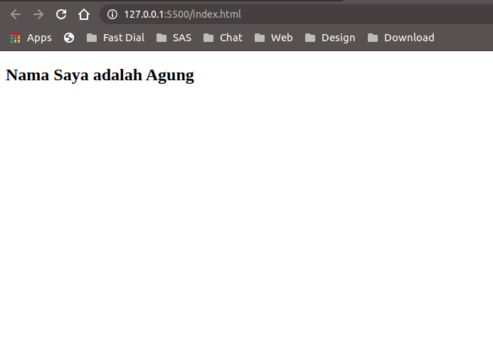

## Menulis Program Vue Pertama Kita

Oke, setelah tools sudah siap mari kita mulai menulis program pertama kita. Kita mulai dengan membuat struktur project kita dulu ya di kode editor masing-masing seperti ini :

```
index.html
app.js
style.css

```

Isi dari Index.html seperti ini :

```
<!DOCTYPE html>
<html lang="en">
<head>
    <meta charset="UTF-8">
    <meta name="viewport" content="width=device-width, initial-scale=1.0">
    <title>Belajar VueJs</title>
    <link rel="stylesheet" href="style.css"> // pemanggilan style.css
</head>
<body>
    <div id="app">
        <h2>Nama Saya adalah {{ name }} </h2>
    </div>
</body>
    <script src="https://cdn.jsdelivr.net/npm/vue/dist/vue.js"></script> //pemanggilan vue dengan cdn
    <script src="app.js"></script> //pemanggilan app.js
</html>

```

Isi dari app.js seperti ini :

```
new Vue ({
    el: '#app',
    data: {
        name: 'Agung'
    }
});

```


Penjelasan kode :

Mari kita bahas kode yang ada didalam *app.js* :</br>
```new Vue({})``` adalah instance yang dipanggil untuk mengkontrol semua yang ada pada aplikasi (contoh diatas adalah index.html), dituliskan sebagai object pada Javascript dimana ada key dan value. Didalannya nanti bisa diisikan data, method dll.
```el: '#app'``` adalah properti berisi elemen root yang akan dimanipulasi DOMnya. Sebagai contoh diatas berisikan ```'#app'``` yaitu diambil dari elemen ```<div id="app">``` dari *index.html* (tanda # karena penggunaan elemennya pakai id). Jadi nanti semua yang ada didalam root elemen app akan bisa dikontrol pakai vue intance ini.
```data: { name: 'Agung'}``` adalah contoh penggunaan properti data untuk digunakan di dalam root #app tadi. Kalau dibaca maka seperti ini, didalam properti data ada object dengan key *name* dan value *'Agung'* dan kalau mau dipanggil ke html maka tuliskan *key*-nya di dalam root elemen (id=app) dan dimasukkan kedalam kurung kurawal. Maka nanti data yang dipangil akan ditampilkan kedalam HTML.

Kode dalam *index.html* </br>
```<div id="app">``` adalah root elemen yang akan dimanipulasi oleh vue instance di app.js.
```<h2>Nama Saya adalah {{ name }} </h2>``` adalah contoh pemanggilan data dengan menuliskan dua kurung kurawal dan diisi dengan key data yang mau ditampilkan. Contoh ```{{ name }}``` akan menghasilkan Agung karena value pada data di app.js berisikan Agung.

Oke, sebelum lihat hasilnya teman-teman baiknya install extenstion di VS Code yang namanya Live Server, ini gunanya agar kita tidak perlu susah-susah reload setiap ada perubahan dari text editor kita. Jadi waktu kita save browser akan otomatis reload. Untuk cara installnya tolong cari di google ya, gampang banget kok. Setelah install, klik kanan pada file index.html lalu pilih Open with Live Server maka jendela browser akan kebuka otomatis dan sudah me load aplikasi kita. 

Hasilnya seperti ini ya :



Lanjut Baca [Belajar VueJs - Data & Method](/belajar-vue-js-3-data-and-method)

Baca Sebelumnya [Belajar VueJs - Intro](/belajar-vue-js-1-intro)
