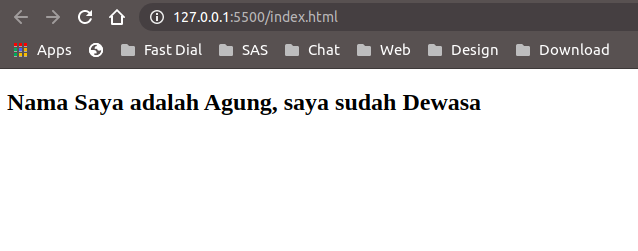

## Data & Method pada VueJs

Oke, Sebelumnya kita sudah membuat aplikasi pertama kita dengan VueJs. Kali ini kita akan membahas lebih dalam tentang *Data* dan *Method* pada VueJs. </br>

Jadi seperti yang ada di tulisan sebelumnya bahwa untuk memanggil data yang sudah dibuat di VueJs caranya sangat mudah, yaitu hanya dengan membuat dua kurung kurawal yang didalamnya diiskan nama properti yang ingin dipanggil, contoh ```{{ name }}```. Sebetulnya kenapa harus begitu, kenapa kita ga langsung tulis aja name tersebut pada HTML? Karena dengan membuatnya pada data di VueJs, nanti data tersebut bisa kita buat dinamis dengan memanfaatkan method. Jadi misal di kondisi tertentu name itu akan berubah, kita bisa pakai conditional *if* untuk melakukannya.

Lanjut ke *Method*, seperti yang sudah disinggung diatas untuk *method* tujuannya adalah untuk membuat fungsi-fungsi yang digunakan untuk memanipulasi data atau DOM agar menjadi dinamis sesuai dengan kebutuhan kita. Berikut contoh kodenya : </br>

```
new Vue ({
    el: '#app',
    data: {
        name: 'Agung',
        usia: 27
    },
    methods: {
        kedewasaan: function () {
            if (this.usia >= 15) {
                return 'Dewasa'
            }else{
                return 'Anak-Anak'
            }
        }
    }
});

```

Contoh diatas kita menambahkan *methods* kedewasaan, jika usia diatas 15 maka dewasa atau jika tidak maka masih anak-anak. Dan hasilnya :



Tentu itu bisa sangat membantu untuk pembuatan sistem yang dinamis bukan. Kedepannya kita akan banyak menggunakan data dan methods untuk membuat contoh-contoh aplikasi pada tutorial ini.


Lanjut Baca [Belajar VueJs - Data Binding](/belajar-vue-js-4-data-binding)

Baca Sebelumnya [Belajar VueJs - Mulai](/belajar-vue-js-2-mulai)