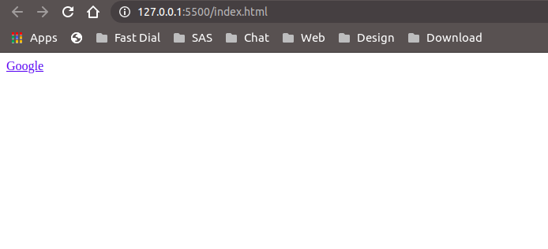
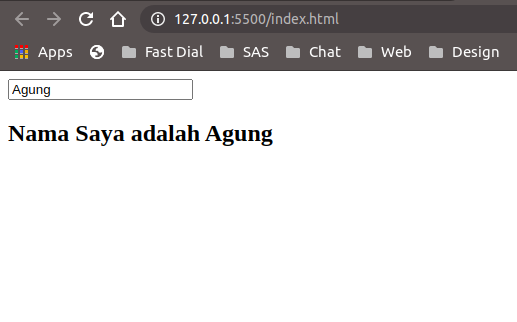

## Data Binding pad VueJs

Ayo mulai belajar salah satu fitur yang cukup penting pada framework Javascript yaitu *data binding*. *Data binding* jika sesuai dengan artinya adalah mengikat data, yaitu mengikat data yang disimpan pada property atau variable yang ada di Vue instance dan mensinkronkan data tersebut ke DOM secara otomatis saat nilai property tersebut berubah. Untuk melakukan *data binding* ada banyak perintah yang bisa digunakan yang biasa disebut dengan *directive*. Pada contoh kali ini saya akan menggunakan v-bind dan v-model.

Yang pertama adalah penggunaan <b>*v-bind*</b>. <br>
<b>*V-bind*</b> digunakan untuk melakukan binding code javascript kedalam kode HTML. Untuk jelasnya coba lihat contoh dibawah ini :

```
<!DOCTYPE html>
<html lang="en">
<head>
    <meta charset="UTF-8">
    <meta name="viewport" content="width=device-width, initial-scale=1.0">
    <title>Belajar VueJs</title>
    <link rel="stylesheet" href="style.css">
</head>
<body>
    <div id="app">
        <a v-bind:href="website">Google</a>
    </div>
</body>
    <script src="https://cdn.jsdelivr.net/npm/vue/dist/vue.js"></script>
    <script src="app.js"></script>
</html>

```

dan pada app.js seperti ini :

```
new Vue ({
    el: '#app',
    data: {
        website: 'https://www.google.com'
    }
});

```

Maka pada browser akan menangkap link dari properti website pada vue instance yang berisi ```'https://www.google.com'``` jadi kalau misal alamat websitenya kita ubah yang ada di properti website, maka linknya secara otomatis akan berubah juga.



Selanjutnya adalah <b>*v-model*</b> yaitu untuk mebuat data binding dua arah yang biasanya digunakan untuk merespon inputan user misalnya dalam bentuk *form input* atau *select elements*. Untuk lebih jelasnya silahkan lihat contoh dibawah ini :

```
<!DOCTYPE html>
<html lang="en">
<head>
    <meta charset="UTF-8">
    <meta name="viewport" content="width=device-width, initial-scale=1.0">
    <title>Belajar VueJs</title>
    <link rel="stylesheet" href="style.css">
</head>
<body>
    <div id="app">
        <input type="text" v-model="name">
        <h2>Nama Saya adalah {{ name }}</h2>
    </div>
</body>
    <script src="https://cdn.jsdelivr.net/npm/vue/dist/vue.js"></script>
    <script src="app.js"></script>
</html>

```

dan app.js tuliskan :

```
new Vue ({
    el: '#app',
    data: {
        name: ''
    }
});

```

Maka pada saat kita mengisi text input maka apa yang kita tulis langsung diambil datanya untuk mengisi property name pada vue instance. Jadi saat saya input nama Agung secara otomatis name akan terisi nama Agung.



Sekian untuk data binding, semoga bermanfaat dan sampai ketemu di tulisan selanjutnya ya.

<br>
<br>


Lanjut Baca [Belajar VueJs - Events](/belajar-vue-js-5-events)

Lanjut Sebelumnya [Belajar VueJs - Data Binding](/belajar-vue-js-4-data-binding)
