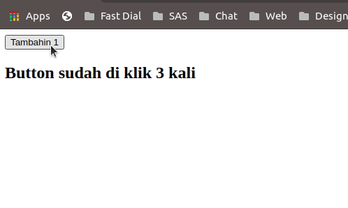
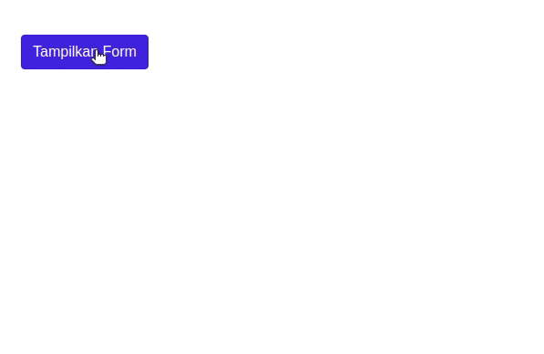

## Belajar Event pada VueJs

Event pada Javascript berfungsi untuk membuat suatu response terhadap event (kejadian) yang telah di atur sebelumnya yang akan memicu jalannya kode Javascript pada sebuah aplikasi web.
Pada VueJs ketika akan menggunakan event kita bisa memanfaatkan beberapa directive diantaranya :

v-on:click untuk memproses event yang terjadi saat suatu button atau element di klik.<br>
v-on:submit untuk memproses event yang terjadi saat button bertipe submit di klik.<br>
v-on:keyup untuk memproses event saya ada masukan dari keyboard

Ok, langsung saja ke study case ya :

```
<!DOCTYPE html>
<html lang="en">
<head>
    <meta charset="UTF-8">
    <meta name="viewport" content="width=device-width, initial-scale=1.0">
    <title>Belajar VueJs</title>
    <link rel="stylesheet" href="style.css">
</head>
<body>
    <div id="app">
        <button v-on:click="ditekan += 1">Tambahin 1</button>
        <h2>Button sudah di klik {{ditekan}} kali</h2>
    </div>
</body>
    <script src="https://cdn.jsdelivr.net/npm/vue/dist/vue.js"></script>
    <script src="app.js"></script>
</html>

```

Pada app.js tuliskan kode berikut :

```
new Vue ({
    el: '#app',
    data: {
        ditekan: 0
    }
});

```

Maka pada browser akan muncul sebuah button dan plain text seperti dibawah ini, yang mana jika tombol di klik maka angka pada plain text akan bertambah sesuai dengan jumlah klik.



Supaya lebih jelas, ayo kita coba ke case lainnya ya, coba lihat kode dibawah ini :

```
<!DOCTYPE html>
<html lang="en">
<head>
    <meta charset="UTF-8">
    <meta name="viewport" content="width=device-width, initial-scale=1.0">
    <title>Belajar VueJs</title>
    <link rel="stylesheet" href="https://stackpath.bootstrapcdn.com/bootstrap/4.5.2/css/bootstrap.min.css" integrity="sha384-JcKb8q3iqJ61gNV9KGb8thSsNjpSL0n8PARn9HuZOnIxN0hoP+VmmDGMN5t9UJ0Z" crossorigin="anonymous">
    <link rel="stylesheet" href="style.css">
</head>
<body>
    <div id="app">
        <form class="container mt-5">
            <button class="btn btn-primary" v-on:click="tampilForm" v-if="hideButton">Tampilkan Form</button>
            <br><br>
            <div v-show="munculForm">
            <div class="form-group">
              <label for="exampleInputEmail1">Email address</label>
              <input type="email" class="form-control" id="exampleInputEmail1" aria-describedby="emailHelp">
              <small id="emailHelp" class="form-text text-muted">We'll never share your email with anyone else.</small>
            </div>
            <div class="form-group">
              <label for="exampleInputPassword1">Password</label>
              <input type="password" class="form-control" id="exampleInputPassword1">
            </div>
            <div class="form-group form-check">
              <input type="checkbox" class="form-check-input" id="exampleCheck1">
              <label class="form-check-label" for="exampleCheck1">Check me out</label>
            </div>
            <button type="submit" class="btn btn-primary">Submit</button>
            </div>
        </form>
    </div>

</body>
    <script src="https://cdn.jsdelivr.net/npm/vue/dist/vue.js"></script>
    <script src="app.js"></script>
    <script src="https://stackpath.bootstrapcdn.com/bootstrap/4.5.2/js/bootstrap.min.js" integrity="sha384-B4gt1jrGC7Jh4AgTPSdUtOBvfO8shuf57BaghqFfPlYxofvL8/KUEfYiJOMMV+rV" crossorigin="anonymous"></script>
</html>

```

Tuliskan kode pada app.js seperti ini :

```
new Vue ({
    el: '#app',
    data: {
        munculForm: false,
        hideButton: true
    },
    methods: {
        tampilForm() {
            this.munculForm = true;
            this.hideButton = false;
        }
    }
});

```

Hasilnya :



Kode diatas dapat memunculkan dan menghide form saat tombol di klik, hal itu dapat terjadi karena kita menggunakan v-on:click untuk mengatur aksi dari tombol dan menggunakan directive v-show untuk menampilkan form. 

<br>
<br>


Lanjut Baca [Belajar VueJs - Event Modifier](/belajar-vue-js-6-event-modifier)

Lanjut Sebelumnya [Belajar VueJs - Data Binding](/belajar-vue-js-4-data-binding)
